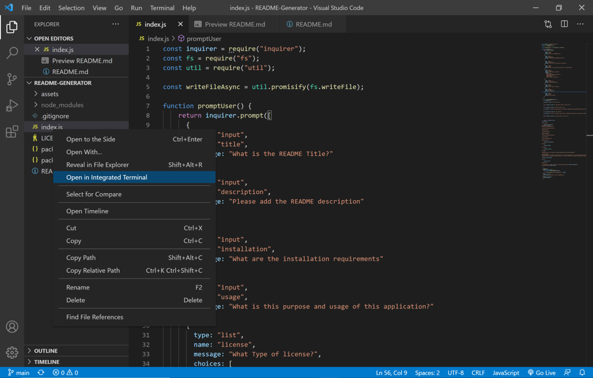
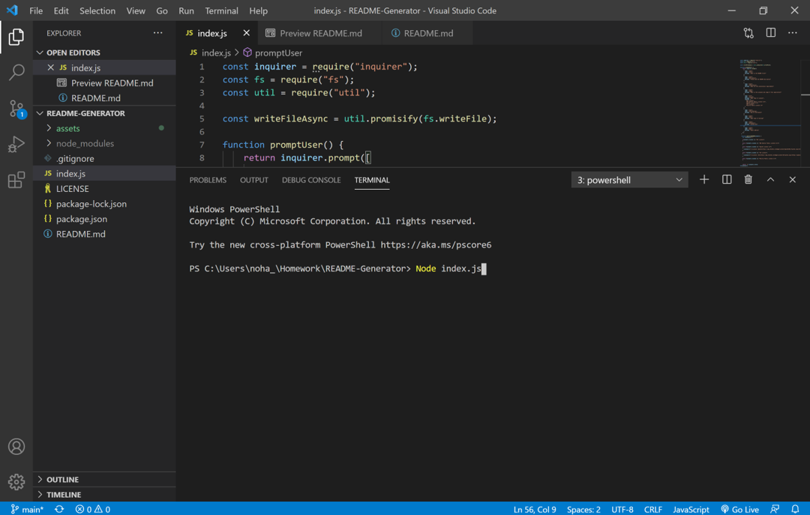
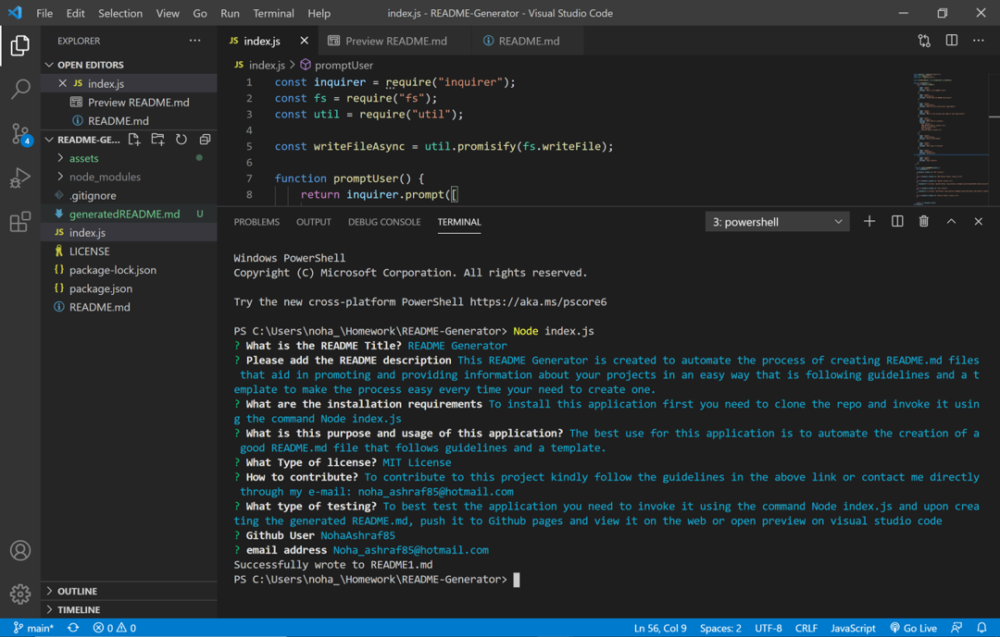
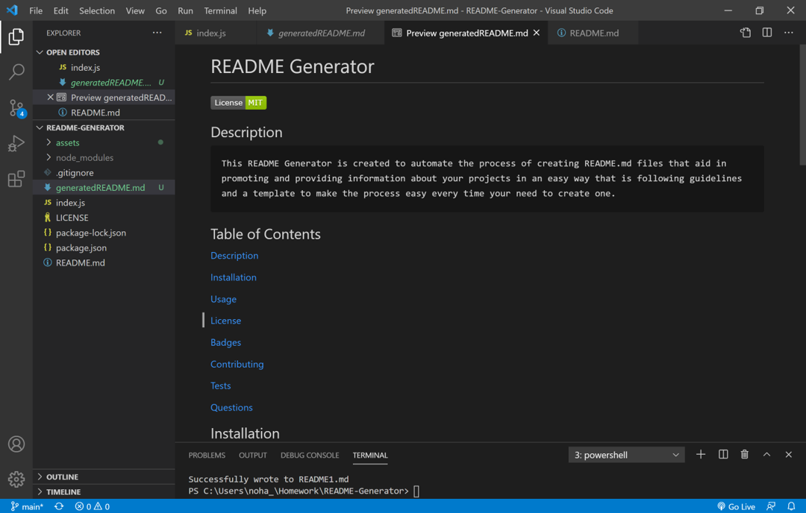

# README-Generator
## Description
This README Generator project is created to automate the process of creating a good, high quality README.md documentation for your projects. The code is based on a template that keeps in mind the README.md guidelines to make sure that the documentaiton is informative and helpful. The below is a demo showing the application. 

[Video](https://drive.google.com/file/d/1CliRmd6f3amMejbr_ZGvX7pp_G2eVGKJ/view)

## Table of Contents

[Description](#description)

[Technologies](#Technologies)

[Installation](#installation)

[Usage](#usage)

[How-it-Works](#How-it-Works)

[License](#license)

[Badges](#Badges)

[Contributing](#contributing)

[Tests](#tests)

[Questions](#questions)

## Technologies
1. JavaScript
2. Node.js

## Installation
In order to install the application:
1. Clone the repo on your machine
2. Open the folder and select the index.js file
3. Open the index.js using the Integrated Terminal in Visual Studio Code
4. In the terminal invoke the applicaiton using the command Node index.js

## Usage
The applicaiton is best used to automate the process of creating a README.md file to document your project, through the questions that appeare in the Integrated Terminal of Visual Studio Code the responses will be populated automatically to your file

## How it Works
Upon opening Visual Studio Code, right click on the file index.js and chose Open in Integrated Terminal.

The Integrated Terminal will oepn in the bottom of Visual Studio.

In order to invoke the application type Node index.js command in the Integrated Terminal.

Upon pressing enter, a list of quetsions will appeare one by one in the Terminal, answer those questions, upon completion a success message will appeare in the Terminal.

Next step is to check the folder tree on the left side of Visual Studio, you should find a file titled generatedREADME.md. Upon clicking on this file it will open in markdown format, if you wish to test if it is formatted successfully, right click on the file and chose Open Preview.

## License 

## Badges

## Contributing 
To contribute to this project, please make sure you follow the guidelines in [The Contributor Covenant](https://www.contributor-covenant.org/) as general guidelines.
Kindly maintain thr highest ethics and respect. For further questions or requests kindly contact me through my e-mail: noha_ashraf85@hotmail.com or [GitHub](https://github.com/NohaAshraf85)

## Tests 
To best test the application you need to invoke it using the command Node index.js and upon creating the generated README.md, push it to Github pages and view it on the web or Open Preview on Visual Studio Code

## Questions
For any questions, please contact me through [GitHub](https://github.com/NohaAshraf85) 
or E-mail: noha_ashraf85@hotmail.com 
